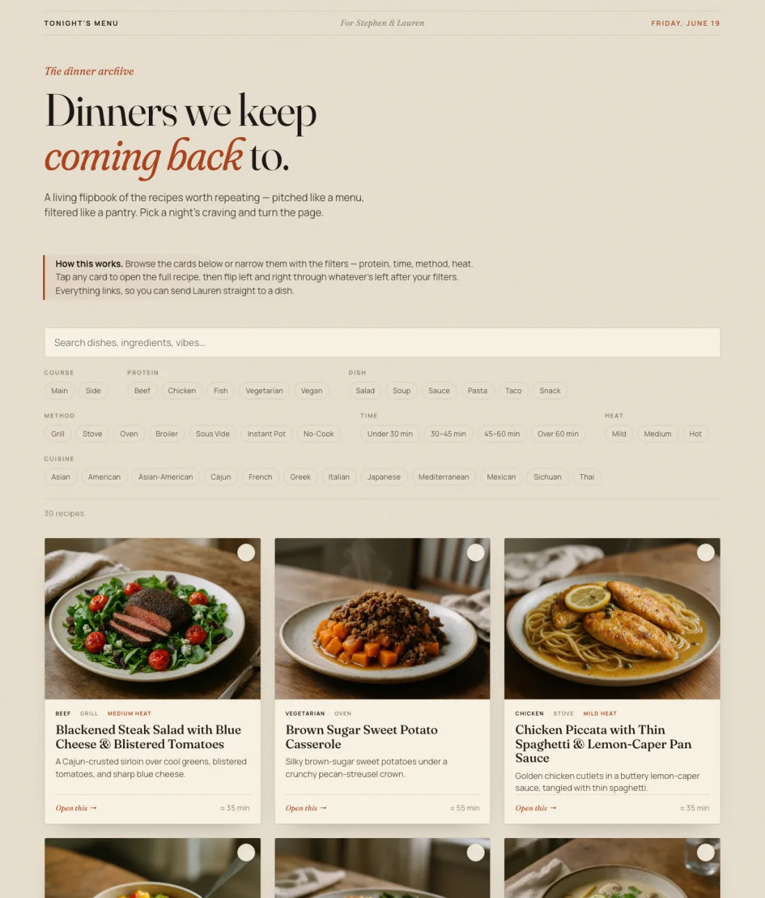

# 🍽️ Tonight's Menu

An interactive flipbook of the dinners Stephen & Lauren keep coming back to —
pitched like a food magazine, filterable like a pantry, and published free on
GitHub Pages so it works on any phone or laptop.

**Live site:** https://smj10j.github.io/cookbook/  *(after the first deploy — see below)*



---

## What's here

- A browsable **menu** of recipes you can filter by course (main/side), protein, dish
  type, time, cooking method, heat level, and cuisine — plus full-text search. The
  **Asian** cuisine filter rolls up Vietnamese, Japanese, Chinese, Thai, Sichuan, etc.
- Click any card to open the full recipe **spread** and flip left/right through the
  results with arrow keys, swipes, or the on-screen arrows.
- A **shopping-list builder**: tick the ✓ on any cards, hit the floating
  **Get Shopping List** button, set how many people you're feeding (quantities scale
  automatically), and copy the list to your clipboard — identical ingredients across
  recipes are merged into one line. Pantry staples (salt, oil, sugar, common spices,
  vinegars, condiments…) start unchecked; a ⚑ marks things you probably have but might
  want to double-check (soy sauce, vanilla, balsamic…).
- Every recipe follows one **standard format**, so timings, ingredients, method,
  chef's tips, and extras are always in the same place.
- Each recipe has a shareable link (e.g. `…/cookbook/#/blackened-steak-salad`) so you
  can text someone straight to a dish.

## Adding a recipe (the easy way)

This repo is built to be driven by **Claude Code**. Just ask, in plain English:

> "Add this recipe: https://www.seriouseats.com/some-recipe"
>
> "Add a recipe for the chicken thing we had — paste: …"
>
> "Make a recipe for sheet-pan gnocchi with a chef tip or two."

Claude uses the **add-recipe skill** (`.claude/skills/add-recipe/`) to:
1. Fetch & clean the source (if it's a URL), or take your text/idea.
2. Reshape it into our standard format, **give it a proper name**, and add chef's tips.
3. Drop it in `recipes/`, rebuild, and (optionally) generate a photo.

You review, then it's live on the next push.

**If you're vague** ("add a recipe" or "something with salmon") Claude will first pitch
**three options** and let you pick before building — so you get a say in the direction.
Give a URL or a specific dish and it skips straight to building.

## Adding a recipe (by hand)

1. Copy `recipes/blackened-steak-salad.md` (the reference recipe) to
   `recipes/your-dish.md`.
2. Edit the fields. The format is documented in **[CLAUDE.md](CLAUDE.md)**; the
   controlled vocabularies (protein, methods, course, heat) live in
   `scripts/lib/schema.mjs`.
3. Run `npm run build` — it validates and regenerates the site data.
4. Commit `recipes/your-dish.md` **and** `docs/recipes.json`.

## Recipe photos (AI-generated)

Photos are optional — recipes without one show an elegant typographic card. To
generate AI food photography for every recipe that's missing one:

1. Put an OpenAI key in a `.env` file (it is git-ignored, never committed):
   ```
   OPENAI_API_KEY=sk-...
   ```
2. Run `npm run photos`. It generates an image per recipe, saves it to
   `docs/images/<slug>.webp`, and adds the `hero:` field to the recipe file.
3. `npm run build` and commit the new images + updated recipes.

See `scripts/generate-photos.mjs` for options (`--only <slug>`, `--force`).

## Local development

```bash
npm install          # one-time: installs js-yaml
npm run preview      # builds, then serves the site at http://localhost:8000
# or:
npm run build        # just regenerate docs/recipes.json
npm run validate     # lint every recipe against the schema
```

The site itself is plain HTML/CSS/JS — no framework, no build step for the page.
The only "build" turns `recipes/*.md` into `docs/recipes.json`.

## How it's deployed

GitHub Pages serves the `docs/` folder on the `main` branch. A GitHub Action
(`.github/workflows/build.yml`) re-runs the build on every push so `docs/recipes.json`
always matches the recipe files — even if you edit a recipe directly on GitHub. It also
scans for accidentally-committed API keys and fails if it finds one.

## Repo layout

```
recipes/      ← the recipes (edit these)
docs/         ← the published site (Pages serves this)
scripts/      ← build, validate, and photo tooling
CLAUDE.md     ← the format spec + house style (for Claude and for you)
```
